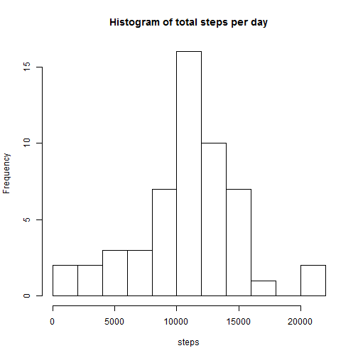
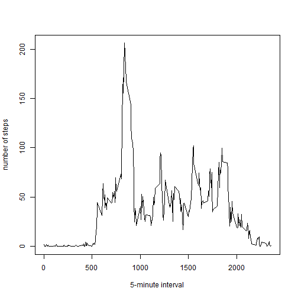
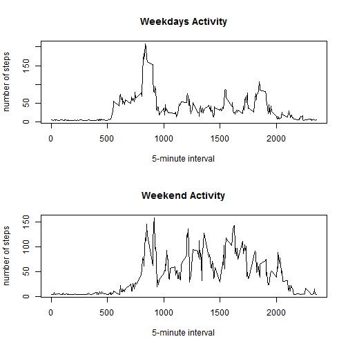

# Reproducible Research: Peer Assessment 1


## 0- Loading and preprocessing the data

### 0.1- Load utils and data

```r
# Load utils
library("reshape2", lib.loc = "C:/Program Files/R/R-3.0.2/library")

# Load Data
data <- read.csv("./activity.csv")
```


### 0.2- Process/transform the data (if necessary) into a format suitable for your analysis

```r
# Convert date variable to Date
data$date <- as.Date(data$date, "%Y-%m-%d")
dim(data)
```

```
## [1] 17568     3
```


## 1- What is mean total number of steps taken per day?
I prefer to eliminate unnecessary data to avoid erros. To answer this question I just need date and steps, in this way my first step is eliminate unecesary data.

### 1.1- Make a histogram of the total number of steps taken each day

```r
# Delete unnecesary data
data_1 <- data[, c("date", "steps")]
dim(data_1)
```

```
## [1] 17568     2
```

```r

# Aggregate data
dataMelt <- melt(data_1, id = c("date"), mesure.vars = c("steps"))
stepsData <- dcast(dataMelt, date ~ variable, sum)

# Make a histogram of the total number of steps taken each day
hist(stepsData$steps, breaks = 10, xlab = "steps", main = "Histogram of total steps per day")
```

 


### 1.2- Calculate and report the mean and median total number of steps taken per day

```r
mean(stepsData$steps, na.rm = TRUE)
```

```
## [1] 10766
```

```r
median(stepsData$steps, na.rm = TRUE)
```

```
## [1] 10765
```


## 2- What is the average daily activity pattern?
To obtain a clean plot I need to eliminate NA values from the original data.

### 2.1- Make a time series plot (i.e. type = "l") of the 5-minute interval (x-axis) and the average number of steps taken, averaged across all days (y-axis)

```r
# 

# Eliminate NA values from original data set
data_No_NA <- subset(data, !is.na(steps))

# Eliminate unnecessary data
data_2 <- data_No_NA[, c("interval", "steps")]
dim(data_2)
```

```
## [1] 15264     2
```

```r

# Agregate Data
dataMelt <- melt(data_2, id = c("interval"), mesure.vars = c("steps"))
dim(dataMelt)
```

```
## [1] 15264     3
```

```r
dataFinal <- dcast(dataMelt, interval ~ variable, mean)

# Plot the data
plot(dataFinal$interval, dataFinal$steps, type = "l", ylab = "number of steps", 
    xlab = "5-minute interval")
```

 

### 2.2- Which 5-minute interval, on average across all the days in the dataset, contains the maximum number of steps?


```r
dataFinal[which.max(dataFinal$steps), ]
```

```
##     interval steps
## 104      835 206.2
```


## 3- Imputing missing values
# 3.1- Calculate and report the total number of missing values in the dataset (i.e. the total number of rows ##with NAs)

```r
# Number of NA values in variable 'steps'
sum(ifelse(is.na(data$steps), 1, 0))
```

```
## [1] 2304
```

```r
# Number of NA values in variable 'date'
sum(ifelse(is.na(data$date), 1, 0))
```

```
## [1] 0
```

```r
# Number of NA values in variablr 'interval'
sum(ifelse(is.na(data$interval), 1, 0))
```

```
## [1] 0
```


### 3.2- Devise a strategy for filling in all of the missing values in the dataset. The strategy does not need to be sophisticated. 

```r
# I'm going to use the mean
averageValue <- mean(data$steps, na.rm = TRUE)
```


### 3.3- Create a new dataset that is equal to the original dataset but with the missing data filled in.

```r
new_data <- data
new_data$steps <- ifelse(is.na(new_data$steps), averageValue, new_data$steps)

# Doble check, calculate the number of NA values in variable step
sum(ifelse(is.na(new_data$steps), 1, 0))
```

```
## [1] 0
```


### 3.4- Make a histogram of the total number of steps taken each day and Calculate and report the mean and median total number of steps taken per day. 

```r
hist(stepsData$steps, breaks = 10, xlab = "steps", main = "Histogram of total steps per day")
```

 

### 3.5- Do these values differ from the estimates from the first part of the assignment? What is the impact of imputing missing data on the estimates of the total daily number of steps?
The values are very similar to the estimates in the first part of the assignment.

## 4- Are there differences in activity patterns between weekdays and weekends?
### 4.1- Create a new factor variable in the dataset with two levels - "weekday" and "weekend" indicating whether a given date is a weekday or weekend day

```r
new_data$weekday <- weekdays(new_data$date)
new_data$week <- ifelse(new_data$weekday == "domingo" | new_data$weekday == 
    "sábado", "weekend", "weekday")
new_data$weekFac <- factor(new_data$week, levels = c("weekday", "weekend"))

# remove unnecessary columns
new_data <- new_data[, c("interval", "steps", "weekFac")]
str(new_data$week)
```

```
##  Factor w/ 2 levels "weekday","weekend": 1 1 1 1 1 1 1 1 1 1 ...
```

### 4.2- Make a panel plot containing a time series plot (i.e. type = "l") of the 5-minute interval (x-axis) and the average number of steps taken, averaged across all weekday days or weekend days (y-axis).

```r
# Create 2 data set for weekdays and weekend days
weekdays <- subset(new_data, weekFac == "weekday")
weekend <- subset(new_data, weekFac == "weekend")

# remove unnecessary columns
weekdays <- weekdays[, c("interval", "steps")]
weekend <- weekend[, c("interval", "steps")]

# Aggregate data
weekdaysMelt <- melt(weekdays, id = c("interval"), mesure.vars = c("steps"))
weekdaysData <- dcast(weekdaysMelt, interval ~ variable, mean)

weekendMelt <- melt(weekend, id = c("interval"), mesure.vars = c("steps"))
weekendData <- dcast(weekendMelt, interval ~ variable, mean)

# plot the data
par(mfrow = c(2, 1))
plot(weekdaysData$interval, weekdaysData$steps, type = "l", ylab = "number of steps", 
    xlab = "5-minute interval", main = "Weekdays Activity")
plot(weekendData$interval, weekendData$steps, type = "l", ylab = "number of steps", 
    xlab = "5-minute interval", main = "Weekend Activity")
```

 

